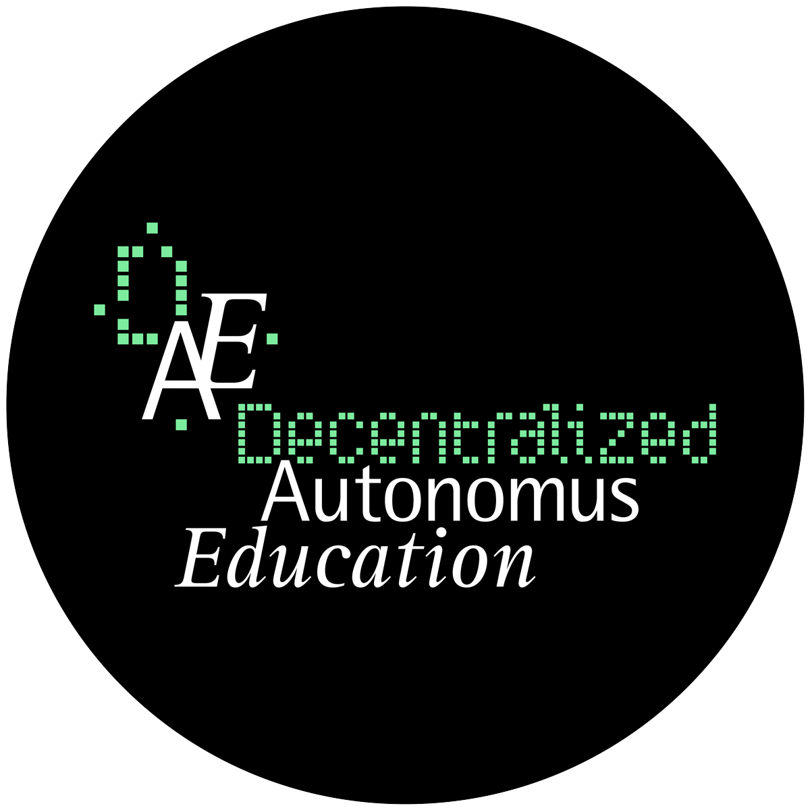

# DAE (Decentralized Autonomous Education)

<p align="center">

</p>

DAE is an innovative learning model that leverages the principles and applications of Web3.  
An instance of the DAE model, called a class, is made of a group of teachers (at least one), a group of learners (at least two), and a topic to teach and learn.
The purpose of the model is to maximize the transfer of knowledge about the topic from the teacher to the learners in a homogeneous way, i.e. without many disparities.

## Quickstart

### Setup

Before launching the application you have to set up this components:

- PostgreSQL Database;
- An EVM RPC Node;
- An IPFS Node.
- Obtain a WalletConnect PROJECT_ID in order to use WalletConnect (for free on https://walletconnect.com/)
- Snapshot API Key (OPTIONAL to avoid strict rate limiting): follow the guide on https://docs.snapshot.org/tools/api/api-keys

Configuration is made by filling the fields inside the .env.example file and than renaming it as .env

Verify that the files within [resources/ipfs](./resources/ipfs/) are reachable from the IPFS node. If you start the application and the base credentials data are not displayed (either image or textual data), upload the files to IPFS.

### Run the application:

#### Installation

- Clone repository
- `cd dae`
- `pnpm install`

#### Build the project:

To build the project run the following command:

```sh
pnpm run build
```

#### Run on local machine:

To run the application on your local machine run the following command:

```sh
pnpm run dev
```

## Package structure

```ml
.
├── apps
│    └── web - "The DAE application"
├── packages
│    ├── abi — "Abi constants"
│    ├── chains — "Supported chains constants and utils"
│    ├── constants — "General constants"
│    ├── database — "Database functions and schemas definitions"
│    ├── hooks — "General hooks"
│    ├── ipfs — "Ipfs connectors"
│    ├── snapshot — "Hooks and functions to interact with snapshot.js"
│    ├── types — "General types definitions"
│    ├── ui — "UI components"
│    └── wagmi — "Hooks and functions to interact with blockchain data (both directly and cached on the db)"
```

## License

DAE App is open-sourced software licensed under the [MIT license](./LICENSE).
